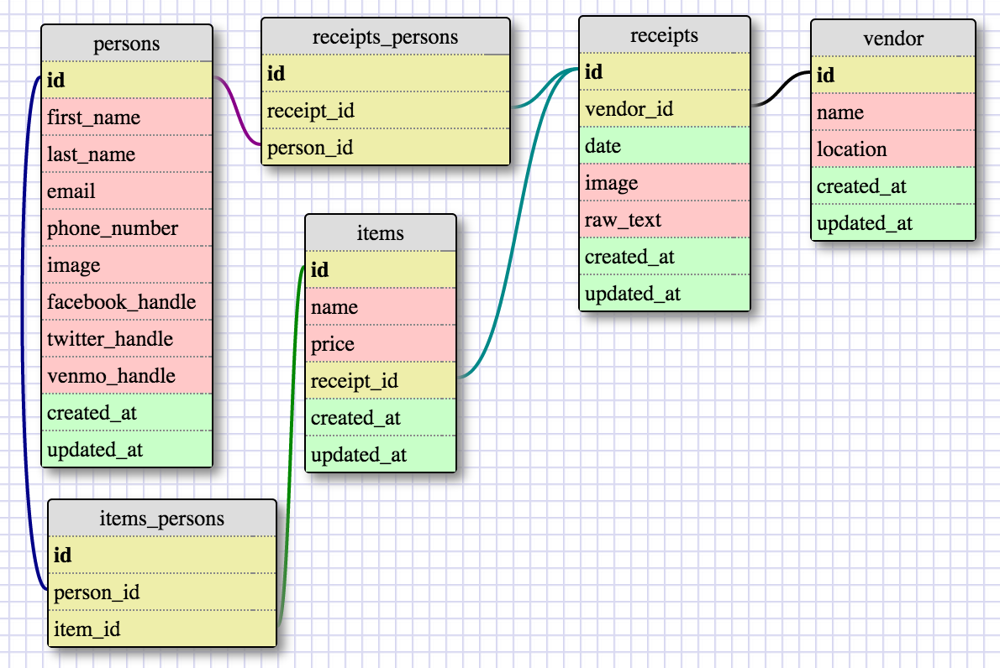

Tabbit Rabbit
=============
Receipt Splitting App

##Problem Space:
When splitting a bill after dinner, it's hard to figure out what each person owes.

##Requirements:
"A receipt-splitting application" that lets diners specify
which items on a collective reciept are there own.

##User Stories:
1) As a user, I should be able to see all the items on a reciept.
2) As a user, I should be able to specifiy which items I ordered.
3) As a user, I should be able to find the subtotal (price) for all of the items I ordered.
4) As a user, I should be able to see all items on a reciept catagorized by purchaser
5) (stretch) As a user, I should be able to find the total with tax and tip for my items.

##Entities:
 - Receipts
 - Items (on the receipts)
 - Persons (who are responsible for paying for the items)
 - Vendors (who sell the items)

##Relationships:
###Reciepts are in a the following relationships:
  - one-to-many w/ Items
  - many-to-many w/ Persons (so require a join table)
  - many-to-one w/ Vendors

###Items are in a the following relationships:
 - many-to-many w/ Persons (so require a join table)

##Schema:

